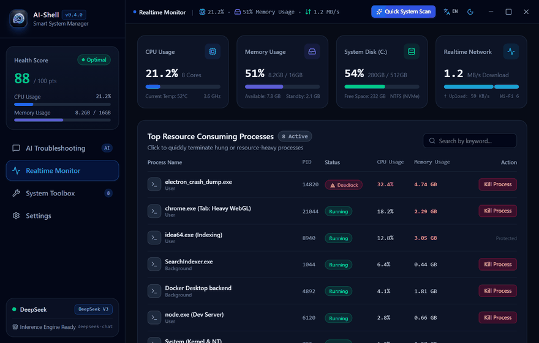
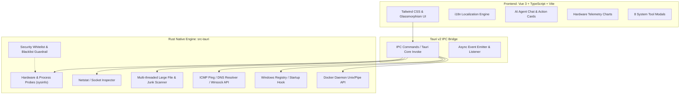

<div align="center">

# ⚡ AI-Shell (智能系统管家)

**An intelligent, lightweight, and visual desktop system maintenance & DevOps Copilot powered by Tauri v2, Rust, and Vue 3.**

[](https://github.com/samxsoft/ai-shell/releases)
[](LICENSE)
[](https://tauri.app)
[](https://www.rust-lang.org/)
[](https://vuejs.org/)
[](https://www.typescriptlang.org/)
[](https://github.com/samxsoft/ai-shell)

[English](README.md) | [简体中文](README_cn.md)

<br />



</div>

## 📥 Quick Download & Installation

Download pre-compiled binaries directly from [GitHub Releases](https://github.com/samxsoft/ai-shell/releases/latest):

| Platform | Package Format | Architecture | Status / Download |
| :--- | :--- | :--- | :--- |
| 🪟 **Windows 10 / 11** | `.msi` setup / `.exe` portable | x86_64 | [👉 Download Windows Release](https://github.com/samxsoft/ai-shell/releases/latest) |
| 🍎 **macOS** | `.dmg` installer | Universal | *Planned for upcoming release* |
| 🐧 **Linux** | `.deb` / `.AppImage` | x86_64 | *Planned for upcoming release* |

---

## 📖 Overview & Mission

**AI-Shell** is a next-generation desktop system diagnostics, maintenance, and optimization tool designed for developers, system administrators, and everyday computer users.

Traditional troubleshooting requires navigating obscure logs, memorizing arcane command-line utilities (`netstat`, `regedit`, `lsof`, `taskkill`, `ipconfig`, `docker system prune`), and manually resolving system bottlenecks. **AI-Shell revolutionizes this paradigm** into an effortless three-step flow:

```
Natural Language Prompt 💬 ──► Autonomous AI Probing 🔍 ──► 1-Click Visual Action Cards ⚡
```

Whether you want to understand *"Why is my PC freezing?"*, *"Find what occupies port 8080 and free it"*, *"Deep clean Windows Update cache"*, or *"Benchmark the fastest DNS"*, **AI-Shell handles everything with native Rust performance and military-grade safety guardrails.**

---

## ✨ Key Features

### 🤖 1. AI-Powered Diagnostics & Autonomous Agent
- **Conversational Troubleshooting**: Ask system questions in plain English or Chinese.
- **Smart Decision Engine**: Automatically plans diagnosis steps, triggers safe telemetry probes, and summarizes root causes with executive-level clarity.
- **Structured Action Cards**: AI proposes actionable system operations with safety tags, clear descriptions, and 1-click execution buttons.
- **Multi-LLM Provider Support**: Connect seamlessly to **DeepSeek (V3/R1)**, **Ollama (100% offline & private)**, **Qwen (通义千问)**, **OpenAI (GPT-4o)**, or **Claude 3.5 Sonnet**.

### 📊 2. Real-time Hardware Telemetry & Resource Monitor
- **Sub-second Hardware Sampling**: Direct Rust kernel probes for CPU temperature & multi-core usage, RAM allocation, disk capacity, and network I/O upload/download bandwidth.
- **Process Load Leaderboard**: Real-time snapshot of top CPU and memory consumers with one-click termination of hung or rogue applications.
- **Quick System Health Score**: High-level visual health index derived from all system metrics.

### 🛠️ 3. 8 Native Rust Diagnostic & Repair Tools (System Toolbox)
All built-in tools are powered directly by low-level Rust probes without third-party bloatware:

| Built-in Tool | Description | Capabilities |
| :--- | :--- | :--- |
| 📡 **Port Inspector & Killer** | Real-time TCP/UDP port occupancy detector | Precise PID/memory lookup, listening table overview, and safe force release. |
| ⚡ **Startup Items Manager** | Windows registry & startup folder analyzer | HKCU/HKLM registry deep scan, boot impact analysis, and 1-click optimization. |
| 🌐 **DNS Benchmark & Switcher** | Concurrent latency tester & DNS selector | Parallel benchmark of global public DNS, 1-click switch, and DHCP reset. |
| 🧹 **Disk Junk & Cache Cleaner** | C: drive deep cleaner | Safely purges Windows Update packages, temp caches, and crash dumps. |
| 🔍 **Large Files Hunter (>500MB)** | High-speed multi-drive disk radar | Locates virtual disks (.vhdx/.iso), media, and archives with File Explorer reveal. |
| ❄️ **Heavy Process Manager & Cooldown** | Real-time process manager & killer | Multi-metric sorting, whitelist core protection, batch kill & rapid cooldown. |
| 🐳 **Docker Container & Image Health** | Docker environment & disk reclamation | Scans stopped containers, dangling images & build cache with 1-click prune. |
| 🧰 **Network Emergency Repair Box** | 4-stage link topology & stack recovery | Flush DNS, reset Winsock, renew DHCP IP, flush ARP, and full network stack reset. |

### 🛡️ 4. Zero-Harm Safety Guardrails
- **Secondary Approval Modals**: Destructive write operations (killing processes, deleting files, rewriting network configurations) strictly require human confirmation.
- **Destructive Command Blacklist**: Hardcoded kernel interception for catastrophic commands (e.g. `rm -rf /`, `format`, `del /s /q System32`).
- **Silent Read-Only Probes**: Harmless telemetry diagnostics run silently in the background for a smooth user experience.

### 🎨 5. Modern Aesthetics & Multi-Language Support
- **Obsidian Dark & Crisp Light Themes**: Beautiful modern UI built with Tailwind CSS, sleek gradients, and glassmorphism.
- **100% Full i18n Localization**: Instant responsive switching between **English (US)** and **简体中文 (Simplified Chinese)**, or automatic OS language detection across all views and modals.

---

## 🏗️ Architecture & Tech Stack



- **Frontend**: Vue 3 (Composition API, `<script setup>`), TypeScript, Tailwind CSS, Lucide Icons, Marked.
- **Desktop Runtime**: [Tauri v2](https://tauri.app/) (lightweight, memory-efficient, ultra-fast native window management).
- **Backend Core**: Rust (low-level OS APIs, WinAPI/Registry, sysinfo, multi-threaded disk walkers).

---

## 🚀 Quick Start

### Prerequisites
1. **Node.js**: `v18.0.0` or higher (Recommended: `v20+`)
2. **Yarn** or **npm** / **pnpm**
3. **Rust & Cargo**: Latest stable Rust toolchain (`rustup update`)
4. **C++ Build Tools**:
   - **Windows**: Microsoft C++ Build Tools (via Visual Studio Installer)
   - **macOS**: Xcode Command Line Tools (`xcode-select --install`)
   - **Linux**: `libwebkit2gtk-4.1-dev`, `build-essential`, `curl`, `libssl-dev`, `libayatana-appindicator3-dev`

### Installation & Development

```bash
# 1. Clone the repository
git clone https://github.com/samxsoft/ai-shell.git
cd ai-shell

# 2. Install frontend dependencies
yarn install

# 3. Launch in development mode with hot reloading
yarn tauri dev
```

### Production Build

```bash
# Build the production desktop application (.exe / .dmg / .deb / .AppImage)
yarn tauri build
```
The compiled binaries will be output to `src-tauri/target/release/bundle/`.

---

## ⚙️ AI Provider Setup

Navigate to **Settings Center** inside AI-Shell to configure your preferred AI provider:

1. **DeepSeek (Recommended)**:
   - Base URL: `https://api.deepseek.com`
   - Model: `deepseek-chat` or `deepseek-reasoner`
2. **Ollama (Offline & Private)**:
   - Base URL: `http://127.0.0.1:11434`
   - Model: `qwen2.5:7b`, `llama3.1:8b`, `deepseek-r1:7b`, etc.
3. **Qwen (通义千问)**:
   - Base URL: `https://dashscope.aliyuncs.com/compatible-mode/v1`
   - Model: `qwen-plus`, `qwen-turbo`, `qwen-max`
4. **OpenAI**:
   - Base URL: `https://api.openai.com/v1`
   - Model: `gpt-4o`, `gpt-4o-mini`
5. **Claude**:
   - Supports Anthropic Claude 3.5 Sonnet API endpoint.

---

## ☕ Buy Me a Coffee / Sponsor

If **AI-Shell** has helped you save time, clean up disk space, or diagnose tricky system bugs, consider buying the author a cup of coffee! Your support fuels continuous development and new features.

<div align="center">

| 微信赞赏 (WeChat Pay) | 比特币捐赠 (Bitcoin BTC) |
| :---: | :---: |
|  |  |
| **扫码支持作者一杯咖啡 ☕** | `bc1qjtp3t7pq3tl8pdwwdvezhnglkh023dx3g80lk0` |

</div>

---

## 🗺️ Roadmap

- [x] Tauri v2 desktop application framework integration
- [x] Real-time CPU, RAM, Disk, and Network telemetry monitoring
- [x] AI agent with conversational diagnosis and executable Action Cards
- [x] 8 Native Rust-powered system diagnostic & repair tools
- [x] Local GGUF Model Hub (Rust multi-threaded streaming downloader with ETA/speed for 0.5B/1.5B/3B models)
- [x] OpenWALDO True Open Source AI integration & provider preset
- [x] 100% full multi-language (i18n) support (zh-CN & en-US)
- [x] Dark / Light / Follow System dynamic theme styling
- [ ] In-app embedded Rust inference runtime (llama.cpp / candle) for 100% zero-dependency offline AI execution
- [ ] Windows Services & Background Daemons manager
- [ ] Automated scheduled system cleanups and health alerts

---

## 🤝 Contributing

Contributions, issues, and feature requests are very welcome!
Feel free to check out the [Issues page](https://github.com/samxsoft/ai-shell/issues).

1. Fork the Project
2. Create your Feature Branch (`git checkout -b feature/AmazingFeature`)
3. Commit your Changes (`git commit -m 'feat: add some amazing feature'`)
4. Push to the Branch (`git push origin feature/AmazingFeature`)
5. Open a Pull Request

---

## 📄 License & Terms of Use

This project is licensed under the **PolyForm Noncommercial License 1.0.0** - see the [LICENSE](LICENSE) file for complete legal terms.

- ✅ **Free for Personal & Educational Use**: You are free to download, run, study, and modify AI-Shell on personal devices for noncommercial and learning purposes.
- ❌ **Commercial Use Prohibited**: Using this software or its source code for commercial profit, commercial redistribution, SaaS/cloud monetization, or embedding into commercial products without prior written authorization from the author is strictly prohibited.
- 💼 **Commercial Licensing**: For enterprise licensing, OEM distribution, or commercial integration inquiries, please contact the repository owner.

<div align="center">
  <sub>Built with ❤️ by tr1st0n yu using Tauri, Rust & Vue.</sub>
</div>
