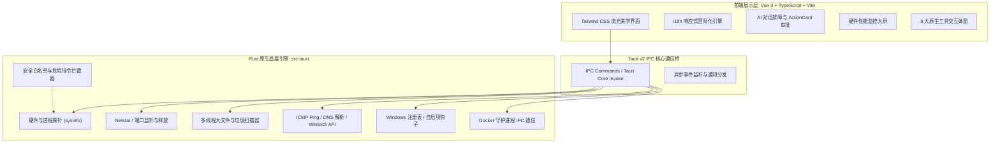

<div align="center">

# ⚡ AI-Shell (智能系统管家)

**基于 Tauri v2 + Rust + Vue 3 构建的轻量级、高颜值、智能化桌面系统运维与故障排查管家。**

[](https://github.com/samxsoft/ai-shell/releases)
[](LICENSE)
[](https://tauri.app)
[](https://www.rust-lang.org/)
[](https://vuejs.org/)
[](https://www.typescriptlang.org/)
[](https://github.com/samxsoft/ai-shell)

[English](README.md) | [简体中文](README_cn.md)

</div>

---

## 📖 项目定位与简介

**AI-Shell** 是一款专为开发者、运维人员以及普通电脑用户打造的**新一代桌面端智能系统维护与排障 Copilot**。

传统的电脑维护和系统排障通常需要用户具备深厚的技术知识：手动查找晦涩的系统日志、在终端输入容易出错的复杂命令（如 `netstat`、`taskkill`、`lsof`、`ipconfig /flushdns`、`docker system prune`），并在复杂的控制面板与注册表中寻找症结。

**AI-Shell 彻底颠覆了这种传统模式**，将其简化为三步闭环：

```
自然语言提问 💬 ──► AI 自动调度系统探针 🔍 ──► 一键可视化处置卡片 ⚡
```

无论是*“电脑为什么突然变卡了？”*、*“帮我排查 8080 端口被谁占用了并释放”*、*“C 盘空间满了深度清理”*，还是*“测试最快的 DNS 并一键切换”*，**AI-Shell 都能依托 Rust 底层极致性能和全方位安全护栏，秒级为您诊断并安全修复。**

---

## ✨ 核心功能特性

### 🤖 1. AI 智能排障与自主智能体 (Agent)
- **自然语言交互**：直接用日常语言向 AI 提问系统状态或反馈故障。
- **智能分析与自主调度**：AI 自动解析问题意图，调度底层只读安全探针采集指标，并生成通俗易懂的根因分析报告。
- **结构化处置卡片 (Action Cards)**：所有系统修复方案均以清晰卡片形式呈现，标明安全等级与影响范围，支持一键审批执行。
- **多主流模型提供商**：原生支持 **DeepSeek (V3/R1)**、**Ollama (本地离线私有化 100% 隐私)**、**通义千问 (Qwen)**、**OpenAI (GPT-4o)** 及 **Claude 3.5 Sonnet**。

### 📊 2. 秒级实时硬件性能与资源监控
- **底层硬件探针**：基于 Rust 直采 CPU 温度与多核占用率、物理内存分配、磁盘容量与健康状态、网络实时上下行流量。
- **高负载进程排行榜**：实时捕捉异常高占用的后台应用，支持快速标记与一键强制结束卡死进程。
- **系统健康度评分**：全维度计算系统综合健康指数，状态瓶颈一览无遗。

### 🛠️ 3. 8 款由 Rust 驱动的原生系统级工具箱 (System Toolbox)
所有工具均由 Rust 底层 API 直采直控，无任何第三方冗余依赖：

| 内置系统工具 | 功能简介 | 核心能力 |
| :--- | :--- | :--- |
| 📡 **端口占用透视与查杀** | 实时 TCP/UDP 端口冲突检测与释放 | 单端口精准反查 PID/内存/路径、全系统监听端口总览、一键强制释放。 |
| ⚡ **开机自启动项管理** | 注册表与启动目录深度透视 | 深入扫描 HKCU/HKLM 注册表与启动文件夹，提供安全性建议与一键优化。 |
| 🌐 **DNS 极速测速与切换** | 国内骨干与全球公共 DNS 并发测速 | 多组节点毫秒级延迟实测、一键无感应用最优 DNS、支持一键恢复 DHCP。 |
| 🧹 **C 盘深度垃圾与缓存清理** | 系统盘深度瘦身与安全释放 | 扫描 Windows Update 安装包、用户临时文件与崩溃日志，一键安全清理。 |
| 🔍 **巨型大文件极速猎手 (>500MB)** | 全盘或指定驱动器超大文件扫描 | 快速筛选隐藏虚拟硬盘 (.vhdx/.iso)、音视频媒体与压缩包，支持资源管理器高亮定位。 |
| ❄️ **高危高负载进程管理器** | 全量进程快照与急速降温 | 多维度排序、系统核心白名单保护、批量结束选中项与一键急速降温。 |
| 🐳 **Docker 容器与镜像专项体检** | 容器环境健康度与空间回收 | 智能扫描已停止容器、未打标签悬挂镜像与构建缓存，一键全盘安全瘦身。 |
| 🧰 **全链路网络急救箱** | 四段式网络拓扑检测与协议栈复位 | 刷新 DNS 缓存、重置 Winsock 目录、重置 TCP/IP 栈、租用 DHCP IP、清除 ARP 缓存。 |

### 🛡️ 4. 零破坏性系统安全护栏
- **写操作人工二次确认**：对结束进程、修改网络配置、删除文件等写操作设置二次确认弹窗，杜绝误触。
- **破坏性危险命令黑名单**：内核层拦截 `rm -rf /`、`format`、`del /s /q System32` 等灾难性指令。
- **只读探针静默执行**：采集硬件状态、日志和进程信息的无害探针在后台静默运行，保障极速流畅体验。

### 🎨 5. 现代美学与多语言全量支持
- **深色黑曜石与明亮清新主题**：基于 Tailwind CSS 精心调校的现代流光设计，支持跟随操作系统自动切换。
- **100% 完整国际化 (i18n)**：所有主界面、侧边栏、监控图表与 8 款系统工具弹窗均完整支持**简体中文**与 **English (US)** 即时无感切换。

---

## 🏗️ 架构设计与技术栈



- **前端框架**：Vue 3 (Composition API, `<script setup>`)、TypeScript、Tailwind CSS、Lucide 图标库、Marked Markdown 渲染器。
- **桌面运行环境**：[Tauri v2](https://tauri.app/)（原生轻量、内存极低占用、启动秒开）。
- **底层后端引擎**：Rust（调用操作系统原生底层 WinAPI/Sysinfo/注册表/网络栈 API）。

---

## 🚀 快速上手与本地开发

### 环境要求
1. **Node.js**：`v18.0.0` 或更高版本（推荐 `v20+`）
2. **Yarn** 或 **npm** / **pnpm**
3. **Rust & Cargo**：最新稳定版 Rust 工具链（通过 `rustup update` 安装）
4. **C++ 编译工具链**：
   - **Windows**：Visual Studio C++ 生成工具 (MSVC)
   - **macOS**：Xcode 命令行工具 (`xcode-select --install`)
   - **Linux**：`libwebkit2gtk-4.1-dev`, `build-essential`, `curl`, `libssl-dev`, `libayatana-appindicator3-dev`

### 本地编译运行

```bash
# 1. 克隆代码仓库
git clone https://github.com/samxsoft/ai-shell.git
cd ai-shell

# 2. 安装前端依赖
yarn install

# 3. 启动开发模式（支持热重载）
yarn tauri dev
```

### 打包正式安装包

```bash
# 构建桌面安装包 (.exe / .dmg / .deb / .AppImage)
yarn tauri build
```
编译生成的安装包位于：`src-tauri/target/release/bundle/`。

---

## ⚙️ AI 模型配置指引

进入 AI-Shell 的**设置中心**，可自由配置你所偏好的大模型提供商：

1. **DeepSeek (强烈推荐)**：
   - Base URL: `https://api.deepseek.com`
   - Model ID: `deepseek-chat` 或 `deepseek-reasoner`
2. **Ollama (本地离线私密)**：
   - Base URL: `http://127.0.0.1:11434`
   - Model ID: `qwen2.5:7b`、`llama3.1:8b`、`deepseek-r1:7b` 等
3. **通义千问 (Qwen)**：
   - Base URL: `https://dashscope.aliyuncs.com/compatible-mode/v1`
   - Model ID: `qwen-plus`、`qwen-turbo`、`qwen-max`
4. **OpenAI**：
   - Base URL: `https://api.openai.com/v1`
   - Model ID: `gpt-4o`、`gpt-4o-mini`
5. **Claude**：
   - 支持 Anthropic Claude 3.5 Sonnet 模型接口。

---

## ☕ 赞赏与支持 (Buy Me a Coffee)

如果 **AI-Shell** 帮您节省了排障时间、释放了宝贵的磁盘空间，或是让系统维护变得更加轻松，欢迎请作者喝一杯咖啡 ☕！您的支持是推动项目持续更新与开发新特性的最大动力。

<div align="center">

| 微信赞赏 (WeChat Pay) | 比特币捐赠 (Bitcoin BTC) |
| :---: | :---: |
|  |  |
| **扫码请作者喝杯咖啡 ☕** | `bc1qjtp3t7pq3tl8pdwwdvezhnglkh023dx3g80lk0` |

</div>

---

## 🗺️ 项目路线图 (Roadmap)

- [x] 基于 Tauri v2 的轻量级跨平台架构搭建
- [x] 秒级 CPU、内存、磁盘与网络上下行实时监控
- [x] AI 智能排障对话与可执行 ActionCard 审批流
- [x] 8 款高性能 Rust 原生系统诊断与急救工具箱
- [x] 100% 完整中英文 (zh-CN / en-US) 多语言支持
- [x] 深色黑曜石 / 明亮清新 / 跟随系统色彩主题
- [ ] Windows 服务 (Services) 与系统守护后台管理器
- [ ] 自动化定时体检、磁盘清理与性能瓶颈预警
- [ ] 硬件驱动检测与已知系统漏洞风险扫描

---

## 🤝 参与贡献

非常欢迎提交 Issue 与 Pull Request！欢迎访问 [Issues 页面](https://github.com/samxsoft/ai-shell/issues)。

1. Fork 本项目
2. 创建特性分支 (`git checkout -b feature/AmazingFeature`)
3. 提交代码变更 (`git commit -m 'feat: 增加某项新特性'`)
4. 推送至远程分支 (`git push origin feature/AmazingFeature`)
5. 新建 Pull Request

---

## 📄 开源许可证与使用须知

本项目采用 **PolyForm Noncommercial License 1.0.0** 许可证，详情请参阅 [LICENSE](LICENSE) 文件。

- ✅ **个人与学习免费**：允许个人用户、学生及技术研究人员免费下载、安装、使用、学习研究或修改源码供个人非商用场景使用。
- ❌ **严禁任何形式的商业化使用**：未经作者书面授权，**严禁将本项目源码或二进制编译文件用于任何商业用途**（包括但不限于商业转售、封装进商业收费产品、部署为盈利性商业云服务/SaaS、企业商业化运营分发等）。
- 💼 **商业授权咨询**：如需获取企业商业授权、专属定制开发或深度业务合作，请通过 GitHub 仓库或 Issues 与作者取得联系。

<div align="center">
  <sub>Built with ❤️ by tr1st0n yu using Tauri, Rust & Vue.</sub>
</div>
